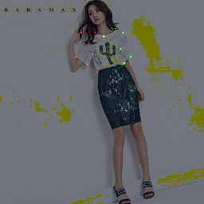
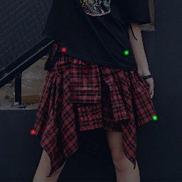

# Hourglass and CPN model in TensorFlow for 2018-FashionAI Key Points Detection of Apparel at TianChi

This repository contains codes of the re-implementent of [Stacked Hourglass Networks for Human Pose Estimation](https://arxiv.org/abs/1603.06937) and [Cascaded Pyramid Network for Multi-Person Pose Estimation](https://arxiv.org/abs/1711.07319) in TensorFlow for [FashionAI Global Challenge 2018 - Key Points Detection of Apparel](https://tianchi.aliyun.com/competition/introduction.htm?spm=5176.11409106.5678.1.95b62e48Im9JVH&raceId=231648). The CPN(Cascaded Pyramid Network) here has several different backbones: ResNet50, SE-ResNet50, SE-ResNeXt50, [DetNet](https://arxiv.org/abs/1804.06215) or DetResNeXt50. I have also tried [Averaging Weights Leads to Wider Optima and Better Generalization](https://arxiv.org/abs/1803.05407) to ensemble models on the fly, although limited improvement was achieved.

The pre-trained models of backbone networks can be found here:

- [ResNet50](https://github.com/tensorflow/models/tree/master/official/resnet)
- [SE-ResNet50](https://github.com/HiKapok/TF_Se_ResNe_t)
- [SE-ResNeXt50](https://github.com/HiKapok/TF_Se_ResNe_t)

## Introduction

The main goal of this competition is to detect the keypoints of the clothes' image colleted from Alibaba's e-commerce platforms. There are tens of thousands images in total five categories: blouse, outwear, trousers, skirt, dress. The keypoints for each category is defined as follows.


Almost all the codes was writen by myself and tested under TensorFlow 1.6, Python 3.5, Ubuntu 16.04. I tried to use the latest possible TensorFlow's best practice paradigm, like [tf.estimator](https://www.tensorflow.org/api_docs/python/tf/estimator) and [tf.layers](https://www.tensorflow.org/api_docs/python/tf/layers). Almost none py_func was used in my codes to maximize the performance. Augumentations like flip, rotate, random crop, color distort were used to reduce overfitting. The current performance of the model is ~0.4% in Normalized Error and got to ~20th-place in the second stage of the competition. 

About the model:

- DetNet is better, perform almost the same as SEResNeXt, while SEResNet showed little improvement than ResNet
- Enforce the loss of invisible keypoints to zero gave better performance
- OHKM is useful
- It's bad to do gaussian blur on the predicted heatmap, but it's better to do gaussian blur on the target heatmaps for lower-level prediction
- Ensemble of the heatmaps for fliped images is worser than emsemble of the predictions of fliped images, and do one quarter correction is also useful
- Do cascaded prediction on whole network can eliminate the using of clothes detection network as well as larger input image
- The native hourglass model was the worst but still have great potential, see the top solution of [here](http://human-pose.mpi-inf.mpg.de/#results)

There are still other ways to further improve the performance but I didn't try those in this competition because of their limitations in applications, for example:

- More larger input image size
- More deeper backbone networks
- Locate clothes first by detection networks
- Multi-scale supervision for Stacked Hourglass Models
- Extra-regressor to refine the location of keypoints
- Multi-crop or multi-scale ensemble for single image predictions
   
If you find it's useful to your research or competitions, any contribution or star to this repo is welcomed.

## Usage
- Download [fashionAI Dataset](https://tianchi.aliyun.com/competition/information.htm?spm=5176.11165261.5678.2.34b72ec5iFguTn&raceId=231648&_lang=en_US) and reorganize the directory as follows:
	```
	DATA_DIR/
		   |->train_0/
		   |    |->Annotations/
		   |    |    |->annotations.csv
		   |    |->Images/
		   |    |    |->blouse
		   |    |    |->...
		   |->train_1/
		   |    |->Annotations/
		   |    |    |->annotations.csv
		   |    |->Images/
		   |    |    |->blouse
		   |    |    |->...
		   |->...
		   |->test_0/
		   |    |->test.csv
		   |    |->Images/
		   |    |    |->blouse
		   |    |    |->...
	```
	DATA_DIR is your root path of the fashionAI Dataset. 
	- train_0 -> [update] warm_up_train_20180222.tar
	- train_1 -> fashionAI_key_points_train_20180227.tar.gz
	- train_2 -> fashionAI_key_points_test_a_20180227.tar
	- train_3 -> fashionAI_key_points_test_b_20180418.tgz
	- test_0  -> round2_fashionAI_key_points_test_a_20180426.tar
	- test_1  -> round2_fashionAI_key_points_test_b_20180601.tar

- set your local dataset path in [config.py](https://github.com/HiKapok/tf.fashionAI/blob/e90c5b0072338fa638c56ae788f7146d3f36cb1f/config.py#L20)
- create one file foler named 'model' under the root path of your codes, download all the pre-trained weights of the backbone networks and put them into different sub-folders named 'resnet50', 'seresnet50' and 'seresnext50'. Then start training(set RECORDS_DATA_DIR and TEST_RECORDS_DATA_DIR according to your [config.py](https://github.com/HiKapok/tf.fashionAI/blob/e90c5b0072338fa638c56ae788f7146d3f36cb1f/config.py#L20)):
    ```sh
	python train_detxt_cpn_onebyone.py --run_on_cloud=False --data_dir=RECORDS_DATA_DIR
	python eval_all_cpn_onepass.py --run_on_cloud=False --backbone=detnext50_cpn --data_dir=TEST_RECORDS_DATA_DIR
	```
	Submit the generated 'detnext50_cpn_sub.csv' will give you ~0.0427
	```sh
	python train_senet_cpn_onebyone.py --run_on_cloud=False --data_dir=RECORDS_DATA_DIR
	python eval_all_cpn_onepass.py --run_on_cloud=False --backbone=seresnext50_cpn --data_dir=TEST_RECORDS_DATA_DIR
	```
	Submit the generated 'seresnext50_cpn_sub.csv' will give you ~0.0424

	Copy both 'detnext50_cpn_sub.csv' and 'seresnext50_cpn_sub.csv' to a new folder and modify the path and filename in [ensemble_from_csv.py](https://github.com/HiKapok/tf.fashionAI/blob/e90c5b0072338fa638c56ae788f7146d3f36cb1f/ensemble_from_csv.py#L27), then run 'python ensemble_from_csv.py' and submit the generated 'ensmeble.csv' will give you ~0.0407.
- training more deeper backbone networks will give better results (+0.001).
- the training of hourglass model is almost the same as above but gave inferior performance

## ##
Some Detection Results (satge one):

- Cascaded Pyramid Network:
  



- Stacked Hourglass Networks:





## ##
Apache License 2.0